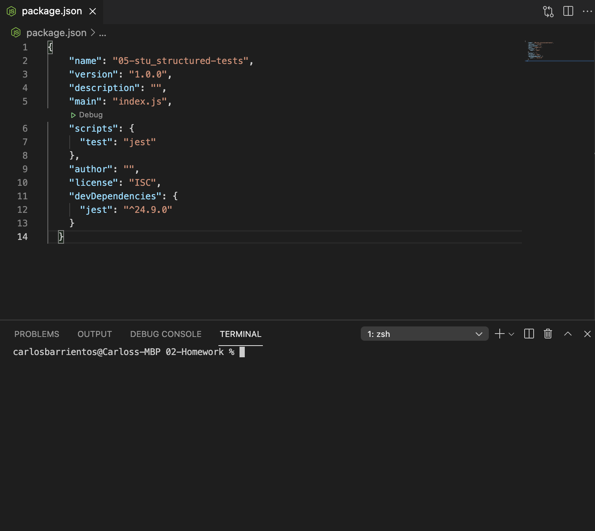
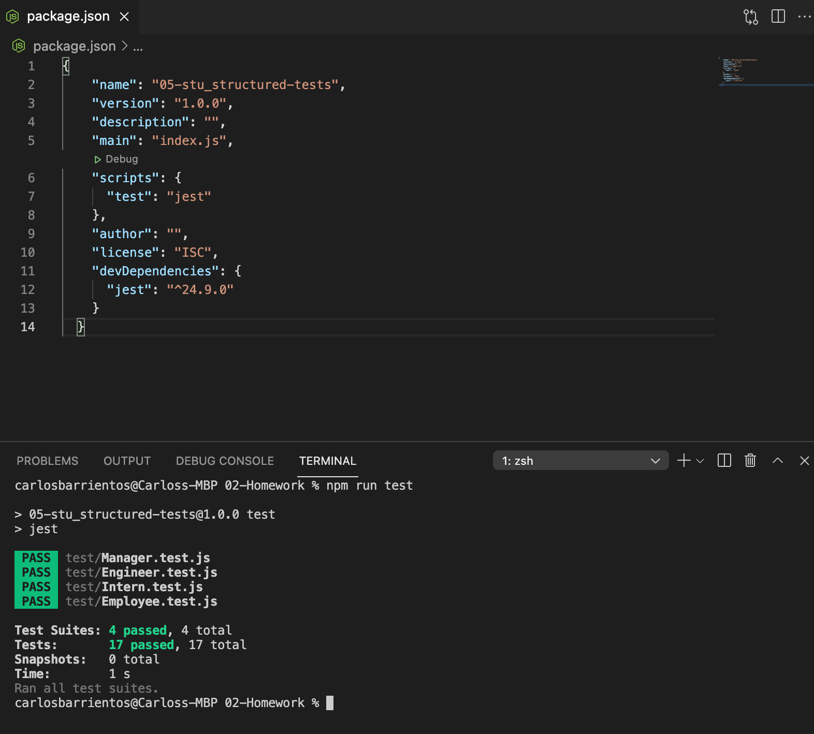

# Team Profile Generator

Video Link: https://www.youtube.com/watch?v=mQhW5DRwPhU
Repository Link: https://github.com/WitnessMyHands/Team-Profile-Generator

## Information

The team profile generator utilizes Node.js in conjunction with the command-line application allowing users to input information about the team manager, engineer(s) and intern(s) for a 'software' engineering / BEE team.

The objective is to generate an HTML webpage from the back-end that displays specific characteristics for each employee.

* Testing was used in the creation of this generator to ensure proper site function. See Screen Grabs Below.

## HTML

The following image shows a mock-up of the generated HTML’s appearance (using Boostrap Styling) and functionality:

## Testing

