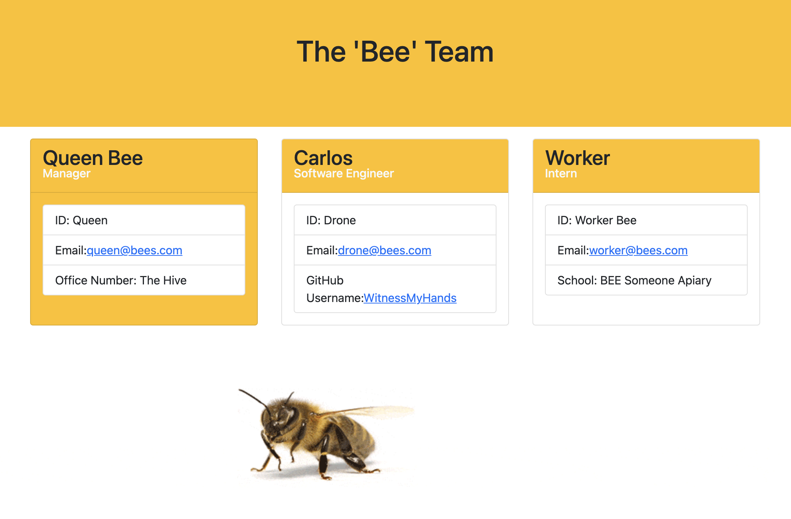

# Team Profile Generator

Video Link: https://www.youtube.com/watch?v=mQhW5DRwPhU

Repository Link: https://github.com/WitnessMyHands/Team-Profile-Generator

## Table of Contents

- [Information](#Information)
- [Installation](#Installation)
- [HTML](#HTML)
- [Testing](#Testing)
- [Questions](#Questions)

## Information

The team profile generator utilizes Node.js in conjunction with the command-line application allowing users to input information about the team manager, engineer(s) and intern(s) for a 'software' engineering / BEE team.

The objective is to generate an HTML webpage from the back-end that displays specific characteristics for each employee.

* Testing was used in the creation of this generator to ensure proper site function. See the (#Testing) area belows for screen captures.

## Installation

To install first type: 'npm install' into the command-line application, setting up your package.json file.

Run the code in terminal, using the command: ‘node app’.

## HTML

The following image shows a mock-up of the generated HTML’s appearance (using Boostrap Styling) and functionality:

## Testing

Jest testing model before tests are ran.

*"test": "jest"*

Successful Jest tests from within the Terminal.

*Seventeen (17) passed Tests from four (4) test suites located within a 'Test' folder.*

## Questions
*Please contact WitnessMyHands via GitHub with any questions or concerns.*

- https://github.com/WitnessMyHands
